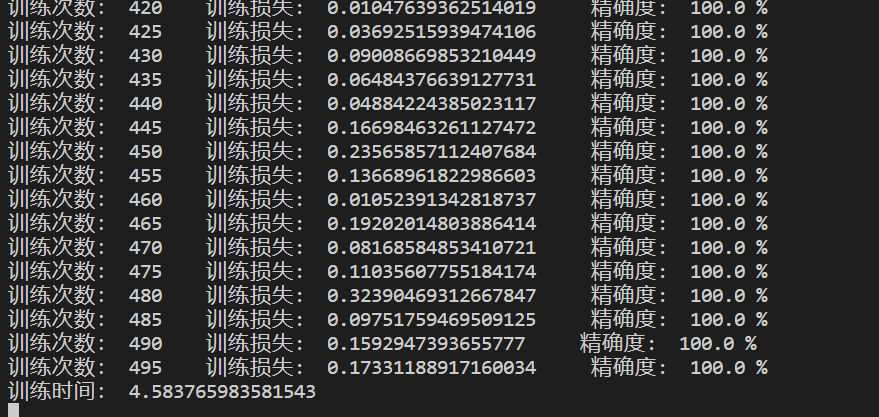
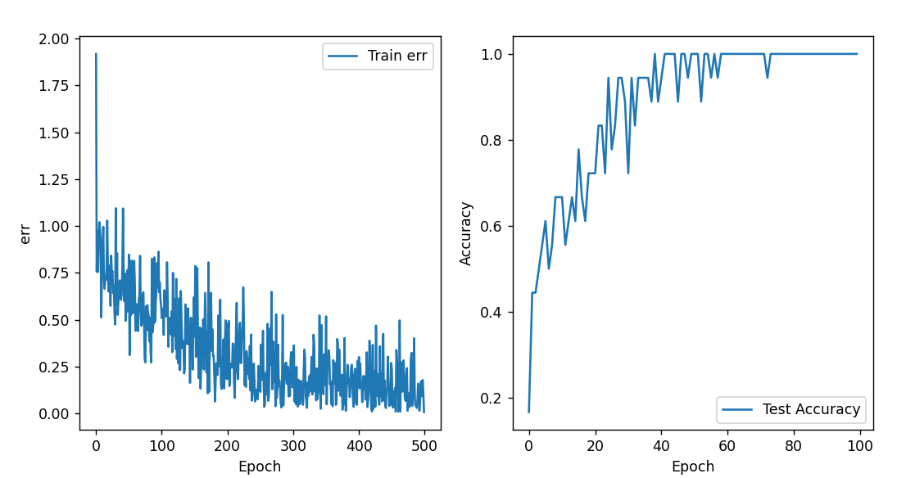
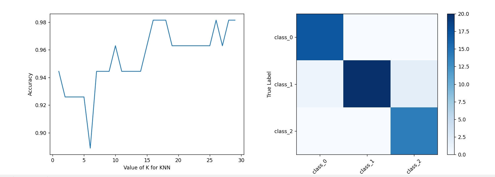
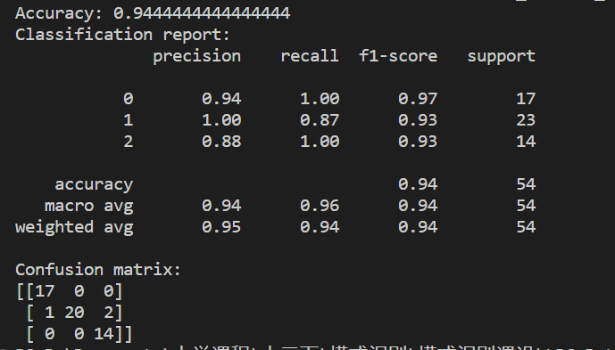

# Wine数据集分类

基于BP神经网络和knn近临法的Wine数据集分类器

### 需要环境

- python3.9
- torch
- numpy
- pandas
- matplotlib
- sklearn

### 数据集目录

.wine_data.csv

### 运行

* 训练BP神经网络：运行bp_train.py
* 测试knn近临分类器：运行knn_train.py

### 训练和测试效果

##### BP神经网络

##### knn近临分类器

